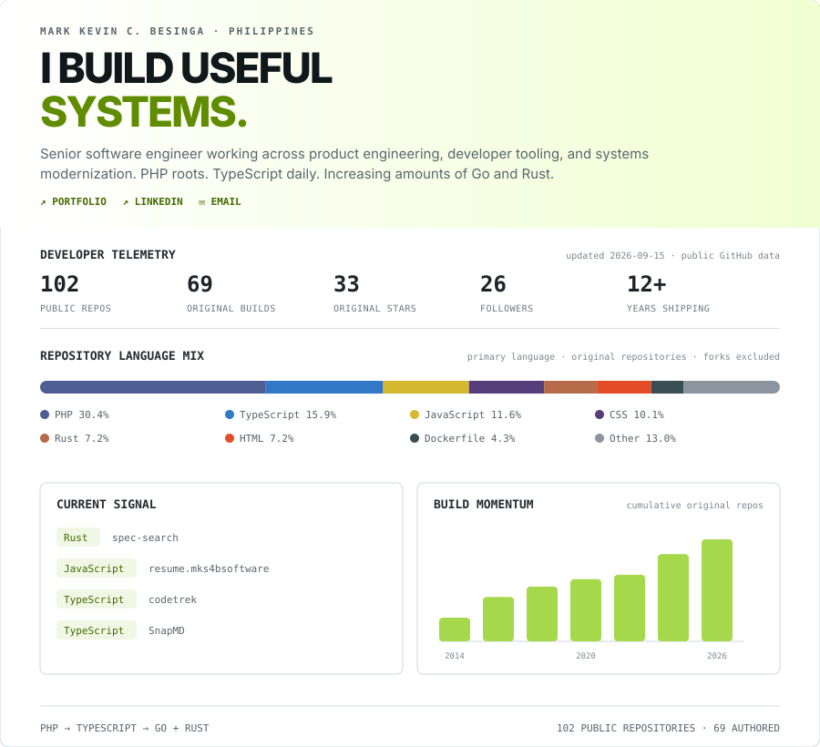

<p align="center">
  
</p>

<p align="center">
  <a href="https://mks4bsoftware.com/">Portfolio</a> ·
  <a href="https://www.linkedin.com/in/besingamkb/">LinkedIn</a> ·
  <a href="mailto:besingamkb@gmail.com">Email</a>
</p>

## Selected builds

| Project | What it does | Built with |
| --- | --- | --- |
| [codetrek](https://github.com/besingamkb/codetrek) | Infinite-zoom code architecture explorer | TypeScript |
| [SnapMD](https://github.com/besingamkb/SnapMD) | Pixel-perfect Markdown export to PDF and images | TypeScript |
| [grit-msg](https://github.com/besingamkb/grit-msg) | Fast CLI for AI-assisted conventional commits | Rust |
| [rusty-diff](https://github.com/besingamkb/rusty-diff) | AI code review for Git branch differences | Rust |

## Current operating range

```text
product engineering  ─────  developer tooling  ─────  systems modernization
Laravel · React              TypeScript · Go            Rust · Docker · AWS
```

I like useful software, sharp tools, boring reliability, and learning just far enough outside my comfort zone to build something new.

<sub>The telemetry card is regenerated daily from public GitHub API data. Forks are excluded from authored-work and language metrics.</sub>
